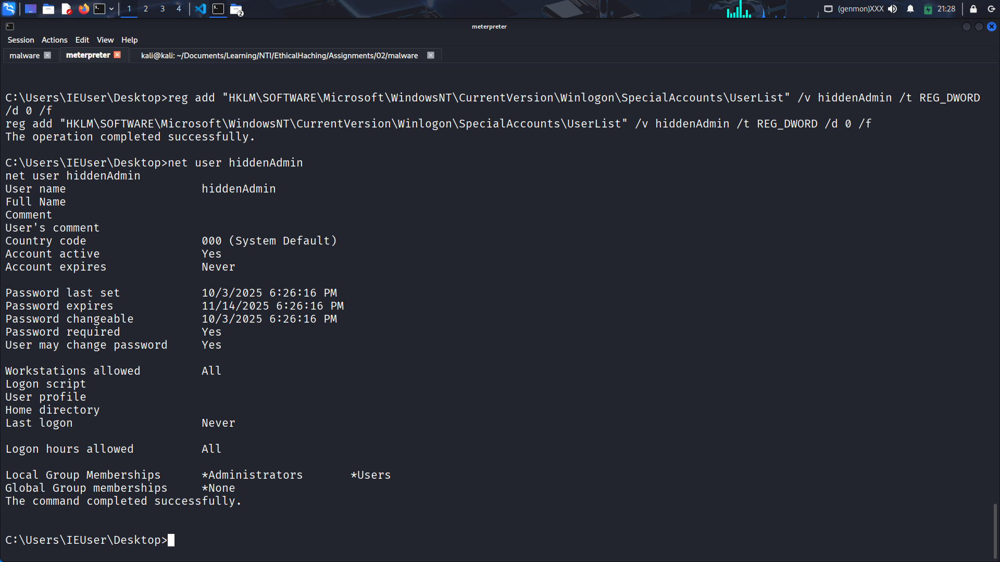

# Windows Backdoor Task

> **Intro:** For every step, i will provide a proof-of-concept screenshot.

---

# Part 1
- **Objective:** Brief.  
- **Hypothesis / Scenario:** First, we will deliver the malware. 
- **Payload Artifact (identifier only):** `./malware/malware.exe`
- **Delivery Vector:** Deliver it using http server.  
- **Proof-of-Concept:**
  

  

# Part 2
- **Objective:** We will establish our listener, as we don't have any C2(Command and Control) server.

- **Connection Result:** The session started here.  

# Part 3
> After establishing the connection, we will have the full control.

- **Objective 1 — Privilege Escalation**  
  **Result:** System privilage gained.  
   

- **Objective 2 — Dump User Credentials**  
  **Goal:** collect credential artifacts.  

  

- **Objective 3 — Create New User**  
  **Goal:** add user with admin privileges.  
  **Findings:** Whether user creation succeeded. Provide the user account name only (no commands).  
  **Evidence:** Screenshot or system account list reference.
  
  
  

- **Objective 4 — Enable Remote Access (RDP, SSH)**  
  **Goal:** enable remote services and authorize account.  
  

- **Objective 5 — Persistence**  
  **Goal:** remain active after reboot.  
  
  

# Part 4
- **Objective:** Remove or reduce forensic traces to the degree allowed by scope.  
- **Actions Taken (high-level):** i have used 
`clearev`, and 
- **Risk / Detection Notes:** There is a high risk when using `clearev` because it removes all logs, and this is suspecious for the SOC Analyst or Blueteam member.

